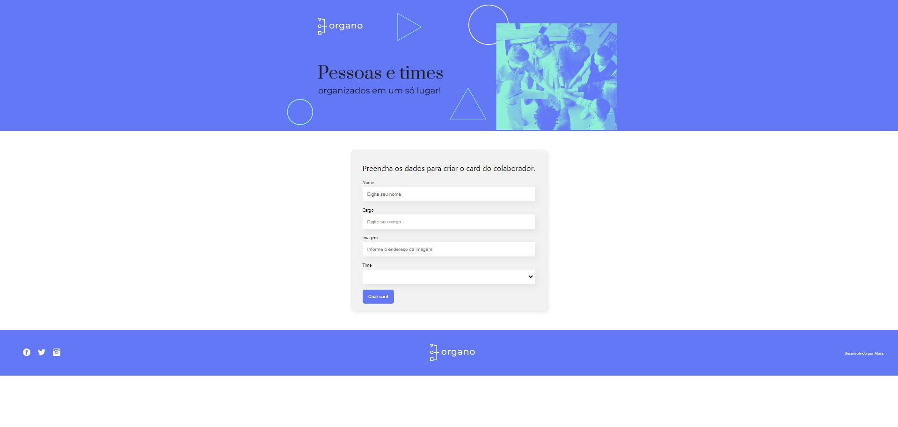
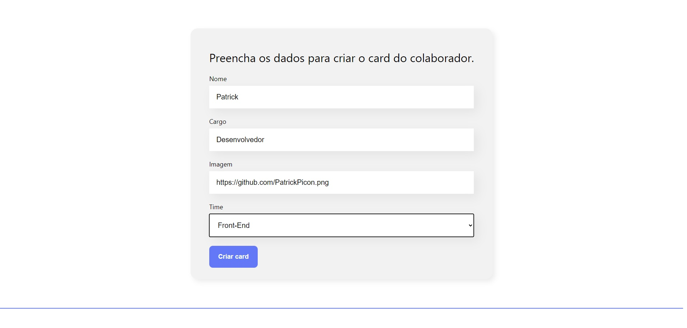

<h1 align="center"> Organo </h1>

Um aplicativo para criar cards seu e do seus times personalizados!

 

  

Exemplo de como utilizar para adicionar uma foto usando o github

  

## ✔ Tecnologias

Esse projeto foi desenvolvido com as seguintes tecnologias:

- React
- JavaScript
- Git e Github

## 💻 Projeto

Um aplicativo de organograma para montar cards de sua equipe personalizados, com nome, cargo, foto podendo utilizar o link de perfil do github adicionando .png no final para utilizar a foto de perfil do github e o time qual deseja adicionar!

- [Visite o projeto online] (https://organo-1pu0mm1kt-patrickpicon.vercel.app/)